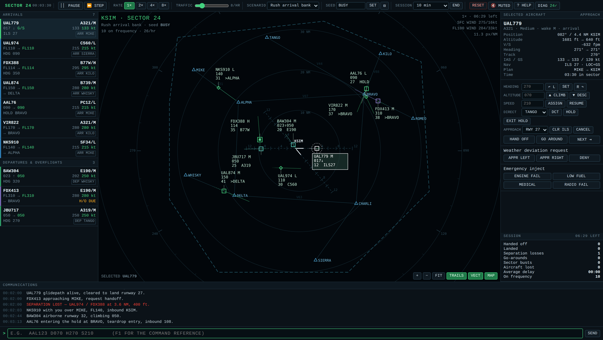

# Sector 24 — Air Traffic Control simulator

A radar-sector ATC simulator in **one self-contained HTML file**. No build step, no
dependencies, no CDN, no ES modules, no network. Open `atc-simulator.html` by
double-clicking it and it runs offline.

## What you are working

One ~60 × 60 NM sector around **KSIM** (field elevation 640 ft, runways 09/27 and
14/32), ten named fixes, five airways.

| Traffic | What you owe it |
| --- | --- |
| **Arrivals** | enter at an edge fix in the descent — sequence them, get them down, clear them for an ILS. They must *land*. |
| **Departures** | start their takeoff roll on a runway — climb them, route them to their exit fix, hand them off at FL100 or above. |
| **Overflights** | cross the sector — keep them separated and hand them off near the boundary. |

Anything that crosses the boundary without a handoff is a **sector bust**.

Loss of separation is less than **5.0 NM** laterally **and** less than **1000 ft**
vertically. Amber = predicted within 2 minutes on current vectors; red = happening
now. Aircraft below 1000 ft above the field on final are exempt.

## Commands

Type a callsign then one or more commands — `AAL123 D070 H270 S210`. With a target
already selected the callsign is optional. Every panel button routes through the
same parser, so the two input methods cannot drift apart.

| Command | Meaning |
| --- | --- |
| `H270` / `HL270` / `HR270` | heading, shorter way / forced left / forced right |
| `C070` `D050` `A090` | climb / descend / maintain (1–3 digits = flight level, 4–5 = feet) |
| `S210` / `SN` | assign IAS / resume normal speed |
| `DCT ALPHA` | proceed direct (unique prefixes work: `DCT AL`) |
| `HOLD BRAVO` / `XH` | enter a right-hand racetrack with the correct entry / leave it |
| `ILS 27` / `CAN` | approach clearance / cancel it |
| `GA` | go around |
| `DEV L` `DEV R` `DEV N` | answer a weather deviation request |
| `HO` | hand off |

An ILS clearance is only accepted inside 12 NM, within ±30° of runway heading,
within 35° of the extended centreline, at or below the 3° glidepath and at 250 kt
or less. Refusals say which condition failed.

Keyboard: `` ` `` pause · `Tab`/`Shift+Tab` next/previous target · `Esc` deselect ·
`↑`/`↓` command history · `F1` reference. With focus off the command box:
`Space` pause, `S` single-step, `1 2 4 8` simulation rate.

## Design notes

- **One angle convention**: compass degrees, 0 = north, clockwise. Every angle goes
  through `normalizeHeading()` / `angleDiff()`; compass becomes math radians only
  inside `compassToScreenRad()` in the render layer.
- **One unit convention**: NM, feet, knots, seconds. Pixels exist only behind
  `worldToScreen()` / `screenToWorld()`.
- **Fixed 50 ms physics timestep** accumulated inside `requestAnimationFrame`,
  clamped to 250 ms of real time per frame so a backgrounded tab cannot spiral.
- **No browser storage of any kind.** There is a self-test that scans the source
  and fails if any appears.
- Aircraft are marked for removal and swept after the update loop, never spliced
  mid-iteration; the selection is always resolved by id, never a cached object.
- Conflicts are evaluated once per unordered pair (`i < j`) with symmetric maths
  and hysteresis on both entry and exit.

## Self-tests

24 invariant checks run on load — angle wrapping, shortest-arc turns, turn and
altitude capture stability, separation symmetry, the 5.0 NM / 1000 ft boundary
case, pair-once conflict evaluation, alert hysteresis, accumulator conservation,
hold entry classification, command-parser robustness against malformed input, the
approach envelope, removal sweeps and dangling selections, seeded replay
determinism, and data block layout. Results are in the **DIAG** panel; the badge
in the header shows the pass count.
