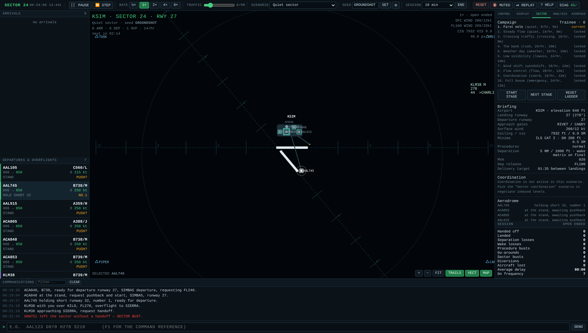
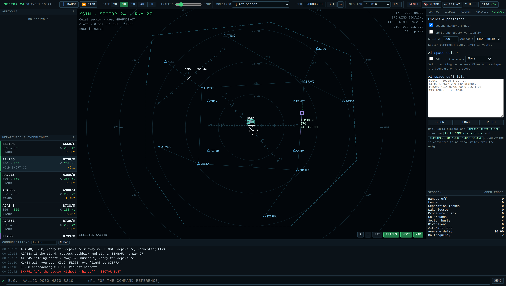

# Sector 24 — Air Traffic Control simulator

A radar-sector ATC simulator in **one self-contained HTML file**. No build step, no
dependencies, no CDN, no ES modules, no network, no browser storage. Open
`atc-simulator.html` by double-clicking it and it runs offline.


## What you are working

One ~60 × 60 NM sector around **KSIM** (field elevation 640 ft, runways 09/27 and
14/32), fourteen fixes, five airways, six published arrivals and six departures.

| Traffic | What you owe it |
| --- | --- |
| **Arrivals** | enter at an edge fix on a published STAR — descend and sequence them, then clear an ILS. They must *land*. |
| **Departures** | start their roll on a runway — climb them to the next sector's release level, route them to their exit fix, hand them off. |
| **Overflights** | cross the sector — keep them separated and hand them off near the boundary. |

Anything that crosses the boundary without a handoff is a **sector bust**.

Loss of separation is less than **5.0 NM** laterally **and** less than **1000 ft**
vertically. On final, **wake turbulence** spacing applies instead — up to 8 NM for a
light behind a super, plus 2 NM more under low-visibility procedures.

## Ground and tower

Departures start at a stand. They need pushback, then taxi themselves to the holding
point and queue; you decide the order off the runway with `LUAW` and `TO`. A takeoff
clearance is refused if the runway is occupied, if something is inside 4 NM on final,
or during a ground stop. Landing aircraft vacate and ask to cross the other runway on
their way to the apron (`XR`). The whole layer can be switched off.



## Simulation

- **Published procedures.** SIDs and STARs with crossing and speed restrictions, and
  "descend via" / "climb via". Restrictions only bind once you have cleared the crew
  to fly the profile. The profiles are derived from the fix geometry, so a short leg
  can never publish a descent no aeroplane could fly.
- **The crews are not perfect.** Each has its own response time and may query a
  clearance, read it back wrong, or decline it. A clearance is *checked* the instant
  you issue it — a refusal is immediate and says why — but *acted on* later.
- **Performance envelopes.** Weight-dependent ceilings ("unable FL410, too heavy"),
  climb and descent rates, and a low-speed buffet floor that rises with altitude.
- **Radar realism.** Sweep-interval display updates, primary-only returns,
  transponder and Mode C failures, and Mode C garble between close pairs.
- **Weather that does something.** Ceiling and visibility drive CAT I minima and
  low-visibility procedures; wind shear on final; drifting cells that crews ask to
  deviate around.
- **Runway changes.** A sustained tailwind turns the airport round: approaches to the
  closed runway are cancelled and arrivals are re-pointed at the other gates.
- **Adjacent sector coordination.** Inbound traffic is *offered* at a level the next
  sector chose — accept it, counter-offer, or refuse it and take the delay.
  Departures need a release level you can renegotiate.
- **Flow control.** Miles-in-trail restrictions over a fix, which is what builds the
  holding stack.
- **Fuel and diversion.** Hold someone too long and they divert, and it costs you.
  Emergencies bring fuel dumping, runway occupancy and a departure ground stop.
- **A second airport.** KRDG opens 19 NM north-west with no published procedures, so
  you vector every one of its arrivals — straight across your own north-west flow.
- **A vertical sector split.** Divide the sector into a low and a high position and
  work one of them; traffic crossing the split is transferred with `HO` in either
  direction, and leaving it too long is a bust.

## Commands

Type `CALLSIGN` then one or more commands — `AAL123 D070 H270 S210`. With a target
selected the callsign is optional; `Tab` completes a partial callsign; with several
aircraft selected (Ctrl+click) one instruction goes to all of them. Every panel
button routes through the same parser, so the two input paths cannot drift apart.

| Command | Meaning |
| --- | --- |
| `H270` / `HL270` / `HR270` | heading, shorter way / forced left / forced right |
| `C070` `D050` `A090` | climb / descend / maintain (1–3 digits = flight level, 4–5 = feet) |
| `C070X` / `EXP` | expedite the level change |
| `BLK080-120` | maintain a block between two levels |
| `PD` | at pilot's discretion |
| `S210` / `S+210` / `S-210` / `SN` | speed, or greater, or less, or resume normal |
| `CANR` | cancel all speed and altitude restrictions |
| `DCT ALPHA` / `WAD ALPHA` | direct / when able, direct |
| `HOLD BRAVO` / `XH` | right-hand racetrack with the correct entry / leave it |
| `DVA` / `CVA` | descend via the arrival / climb via the departure |
| `ILS 27` / `CAN` / `GA` | approach clearance / cancel / go around |
| `DEV L` `DEV R` `DEV N` | answer a weather deviation request |
| `DUMP` / `REL120` | approve fuel dumping / ask for a lower release level |
| `HO` / `QSY` | hand off / send it to the next frequency |
| `NOTE text` / `UNDO` | annotate a strip / take back the last clearance |
| `PB` `LUAW` `TO` `HS` `XR` | pushback / line up and wait / takeoff / hold short / cross |
| `ACC 3` `CTR 3 120` `REJ 3` | answer coordination offer #3 |
| `MIT BRAVO 20` / `RWY 09` | impose miles in trail / turn the airport round |

An ILS clearance is only accepted inside 12 NM, within ±30° of runway heading,
within 35° of the extended centreline, at or below the 3° glidepath and at 250 kt or
less. Refusals name the condition that failed.

## Interface

Five tabs beside the scope:

- **CONTROL** — the selected aircraft and every clearance as a button.
- **DISPLAY** — declutter levels, colour by kind or altitude band, a colour-blind-safe
  palette, altitude filter, 5 NM halos, MSA grid, lat/long graticule, vector length,
  trail length, brightness, UI scale, scope rotation to the landing runway,
  range-and-bearing and closest-point-of-approach tools, the vertical profile view,
  and PNG export.
- **SECTOR** — the campaign ladder, the briefing, the aerodrome and its departure
  queue, coordination offers, flow restrictions, runway changes, the realism switches,
  an AI controller that works the sector for you, two-controller hot-seat positions,
  and the scenario script box.
- **ANALYSIS** — live advisories with suggested resolutions, workload over time, a
  conflict heat map, route efficiency and the fuel cost of your vectoring.
- **AIRSPACE** — the second airport, the vertical split, a scope editor for dragging
  fixes and reshaping the boundary, and the airspace definition itself.



## Building your own airspace

**EXPORT** on the AIRSPACE tab writes the whole sector out as text. Edit it, paste it
back, press **LOAD**; a definition that will not run is refused and the old one stays.

```
sector -30,28 6,32 30,22 32,-10 12,-30 -20,-30 -32,-12 -32,12
airport KSIM 0 0 640 primary
runway KSIM 09/27 90 0 0.6 1.05
fix TANGO -8 28 edge
airway V21 MIKE ALPHA DELTA WHISKY
star RIDGE2 TANGO north ALPHA 11000 250
```

For a real field, give an `origin` latitude and longitude and place things in degrees:

```
origin 51.4775 -0.4614
airportll EGLL 51.4775 -0.4614 83 primary
fixll OCK 51.3050 -0.4472 edge
```

There is also a **ten-stage campaign** with a pass mark per stage and a controller
rating earned across the run.

Drag arrival strips into the order you intend to land them; you are scored against
your own plan. Press `R` to scrub the replay back, watch a conflict develop, then
**TAKE OVER HERE** to carry on from that moment against identical traffic — each
separation loss in the summary has its own REPLAY button.

Ten scenarios, including a guided tutorial, low visibility, wind shift, flow control
and sector coordination. A session can be written as a short text script and shared:

```
seed RUSH-1
rate 20
wind 270/18
t=0    spawn arrival TANGO 14000 AAL123
t=180  emergency AAL123 engine
t=300  mit BRAVO 20
t=420  rwy 09
```

## Design notes

- **One angle convention**: compass degrees, 0 = north, clockwise. Every angle goes
  through `normalizeHeading()` / `angleDiff()`; compass becomes math radians only in
  the render layer.
- **One unit convention**: NM, feet, knots, seconds. Pixels exist only behind
  `worldToScreen()` / `screenToWorld()`, which also carries the scope rotation.
- **Fixed 50 ms physics timestep** accumulated inside `requestAnimationFrame`,
  clamped to 250 ms of real time per frame so a backgrounded tab cannot spiral.
- **No browser storage of any kind.** A self-test scans the source and fails if any
  appears. Personal bests live in memory for the run, by design.
- Aircraft are marked for removal and swept after the update loop, never spliced
  mid-iteration; the selection is always resolved by id, never a cached object.
- Conflicts are evaluated once per unordered pair (`i < j`) with symmetric maths and
  hysteresis on both entry and exit.

## Self-tests

45 invariant checks run on load — angle wrapping, shortest-arc turns, turn and
altitude capture stability, separation symmetry, the 5.0 NM / 1000 ft boundary case,
pair-once conflict evaluation, alert hysteresis, accumulator conservation, hold entry
classification, command-parser robustness, the approach envelope, removal sweeps and
dangling selections, seeded replay determinism, published-procedure flyability, wake
spacing monotonicity, the rotated transform round-trip, data block layout and sizing,
the advisor and hint output, the AI controller actually landing traffic, the full
ground sequence from stand to airborne, runway exclusivity, campaign judging, airspace
export round-tripping, refusal of a broken airspace, real-world coordinate conversion,
the vertical split in both directions, the second airport, export formatting,
efficiency accounting, and that the test sandbox leaks nothing into the live session.

Results are in the **DIAG** panel; the header badge shows the pass count.
